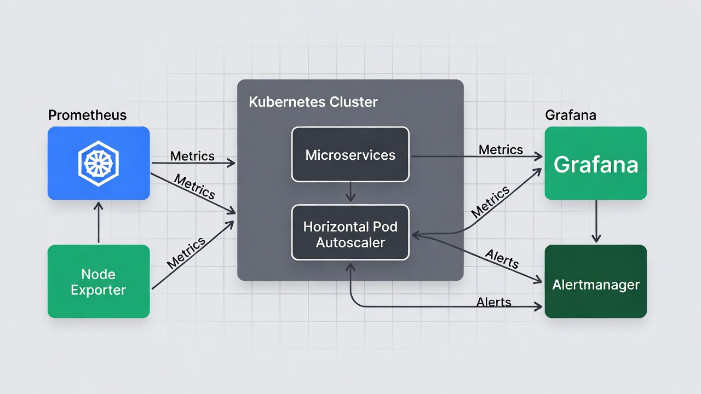
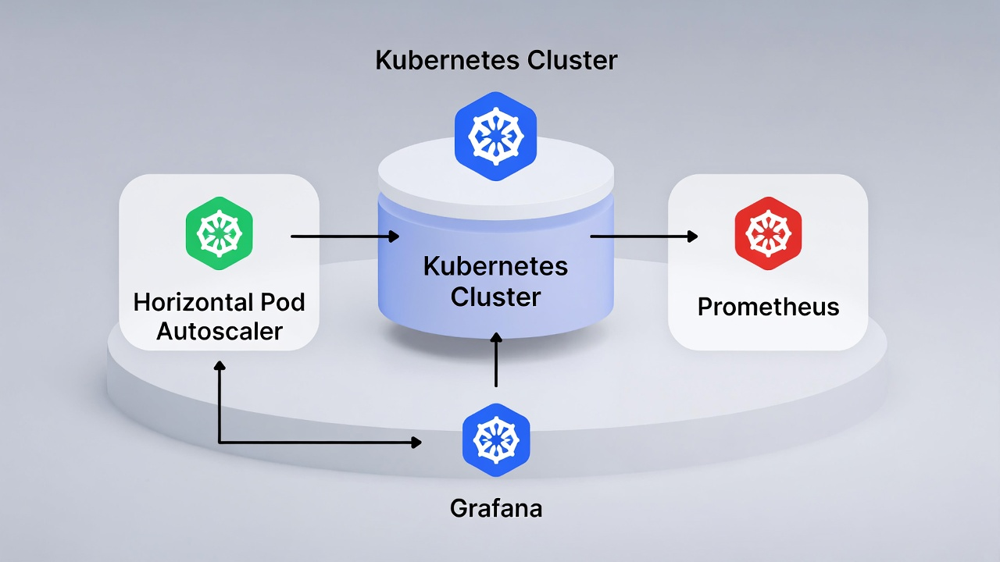

# Kubernetes Microservices com Autoscaling & Observabilidade

<p align="center">
  
  
  
  
</p>

**Projeto de portfólio que demonstra um ambiente cloud-native realista:**  
Deploy de microserviço em Kubernetes + **autoscaling automático (HPA)** baseado em CPU + monitoramento completo com Prometheus e Grafana + teste de carga para validar a escalabilidade.

> "Queria provar que consigo configurar escalabilidade horizontal e observabilidade em Kubernetes — tudo reproduzível localmente."

### O que este projeto entrega (em 30 segundos)

- Microserviço containerizado (ex: API simples)
- Deploy em Kubernetes (Minikube/Kind)
- **Autoscaling real** com Horizontal Pod Autoscaler (HPA) → pods aumentam/diminuem sozinhos
- Monitoramento de métricas com Prometheus
- Dashboards bonitos e funcionais no Grafana
- Teste de carga simples para disparar o scaling
- Estrutura profissional + documentação clara

### Arquitetura completa

<p align="center">
  
</p>
<p align="center">
  
</p>

**Fluxo principal:**
- Cliente → Service → Pods (microserviço)
- HPA monitora CPU → escala pods automaticamente (min 1 → max 5+)
- Prometheus scrapeia métricas dos pods
- Grafana exibe dashboards em tempo real (CPU, pods, requisições, etc.)

- [Diagrama HPA com Prometheus/Grafana (muito parecido com o seu setup)](https://miro.medium.com/1*O2O5VHWhk_4fQ5T4A-NeIA.png)  
- [Fluxo HPA clássico + scaling visual](https://k21academy.com/wp-content/uploads/2024/06/CPT2406212146-899x675-1.gif)  
- [Monitoring K8s com Prometheus/Grafana](https://miro.medium.com/1*qBwb4cI9dTYInvlo2oD3LA.png)

### 🛠️ Tecnologias & Ferramentas

| Categoria          | Ferramenta              | O que faz no projeto                              |
|--------------------|-------------------------|---------------------------------------------------|
| Orquestração       | Kubernetes (Minikube/Kind) | Gerencia pods, services e scaling               |
| Containerização    | Docker                  | Empacota a aplicação                             |
| Autoscaling        | Horizontal Pod Autoscaler (HPA) | Escala pods baseado em CPU (ou custom metrics) |
| Monitoramento      | Prometheus              | Coleta métricas da aplicação e do cluster        |
| Visualização       | Grafana                 | Dashboards interativos e alertas visuais         |
| CLI                | kubectl                 | Deploy e troubleshooting                         |

### Como rodar o projeto (passo a passo)

**Pré-requisitos**
- Docker instalado
- Minikube ou Kind rodando (`minikube start` ou `kind create cluster`)
- kubectl instalado

1. Clone o repositório
   ```bash
   git clone https://github.com/SEU_USUARIO/k8s-microservices.git
   cd k8s-microservices
   ```

2. (Opcional) Build da imagem (se não usar imagem pronta)
   ```bash
   docker build -t sua-api:latest ./api/
   minikube image load sua-api:latest   # ou kind load docker-image
   ```

3. Deploy da aplicação + HPA + monitoramento
   ```bash
   kubectl apply -f k8s/     # Deployment, Service, HPA
   kubectl apply -f monitoring/   # Prometheus + Grafana
   ```

4. Verifique tudo rodando
   ```bash
   kubectl get pods,svc,hpa
   ```

5. Acesse a API
   ```bash
   minikube service api-service --url
   # ou kubectl port-forward svc/api-service 8080:80
   ```

6. Acesse o Grafana (veja métricas e scaling)
   ```bash
   kubectl port-forward svc/grafana 3000:3000
   ```
   → Abra http://localhost:3000  
   Login: **admin / admin**  
   Adicione Prometheus como datasource (geralmente `http://prometheus:9090`)

### Teste de carga & Autoscaling em ação

Gere carga na API:
```bash
while true; do curl http://localhost:8080/endpoint-pesado; sleep 0.1; done
```

Monitore o scaling em tempo real:
```bash
kubectl get hpa -w
```

**O que você vai ver:**
- CPU sobe → HPA cria mais pods automaticamente
- Pods extras aparecem em `kubectl get pods`
- Gráficos no Grafana mostram o aumento de réplicas e CPU caindo

### Habilidades DevOps demonstradas

- Configuração de Deployment, Service e HPA em Kubernetes
- Autoscaling horizontal baseado em métricas de recursos
- Implantação de stack de monitoramento (Prometheus + Grafana)
- Integração de métricas da aplicação com o cluster
- Testes manuais de carga + validação de resiliência
- Documentação reproduzível e profissional